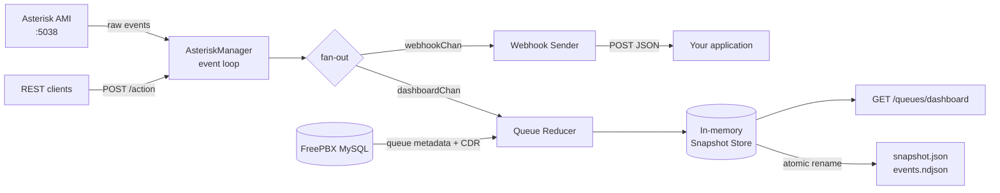

<div align="center">

# 📞 AMIgow

**A single, tiny Go binary that turns Asterisk AMI into webhooks, a REST API, and a live queue dashboard.**

Plug it next to your Asterisk / FreePBX box, point it at a webhook URL, and start receiving
clean JSON for every answered, missed and hung-up call — no dialplan hacks, no AGI scripts.

[](https://go.dev)
[](https://www.asterisk.org)
[](https://www.openapis.org)
[](#-docker)
[](LICENSE)

[](https://github.com/Ctrl-Mota/AMIgow/stargazers)
[](https://github.com/Ctrl-Mota/AMIgow/issues)
[](https://github.com/Ctrl-Mota/AMIgow/commits)
[](#-contributing)

[Quick Start](#-quick-start) · [API Docs](#-api-documentation) · [Configuration](#%EF%B8%8F-configuration) · [Webhooks](#-webhooks) · [Queue Dashboard](#-queue-dashboard) · [Deployment](#-deployment)

</div>

---

## 🤔 What is this?

Asterisk speaks **AMI** — a raw, line-based TCP protocol that streams hundreds of low-level
events per call. Most of the time you don't want that firehose: you want to know *"call answered"*,
*"call missed"*, and you want it as a JSON `POST` to your app.

**AMIgow sits in the middle.** It keeps a persistent AMI connection, translates the noise into four
meaningful call events, and exposes everything through a documented HTTP API:

```
                  ┌─────────────────────────────────────────────┐
   Asterisk  ───►  │  AMIgow                                     │  ───►  Your webhook
   (AMI 5038)      │  event translation · REST API · queue state  │  ───►  Your dashboard
                  └─────────────────────────────────────────────┘
                                       ▲
                              FreePBX MySQL (optional)
```

<details>
<summary><b>Architecture in detail</b> (click to expand)</summary>



Every relevant AMI event flows through a reducer that mutates an in-memory snapshot and bumps a
monotonic `version`. The dashboard endpoint only ever reads memory — it never queries AMI or MySQL
on request, so it stays fast enough to poll every 2 seconds.

</details>

---

## ✨ Features

| | Feature |
|---|---|
| 📡 | **Persistent AMI connection** with automatic reconnect and context-based graceful shutdown |
| 🎯 | **Semantic call events** — `answer`, `hangup`, `missed`, `invite` — extracted from raw AMI noise |
| 🪝 | **Webhook delivery** with per-webhook timeout and event filtering |
| 🚀 | **REST API** to drive Asterisk: originate actions, CLI commands, hangups, channel transfers |
| 👥 | **Queue management** — add/remove agents, query queue status |
| 📊 | **Live queue dashboard** as JSON: waiting callers, agent states, SLA, ASA, abandon rate, alerts |
| 📚 | **Auto-generated OpenAPI 3.1 docs** with a browsable UI — see [API Documentation](#-api-documentation) |
| 🔐 | **API key auth** on every endpoint (docs and health stay public) |
| 🗄️ | **CDR lookup** straight from the FreePBX `cdr` table by `linkedid` |
| 📦 | **Single static binary** — no runtime deps, ~12 MB, Docker and systemd ready |

---

## 📋 Requirements

- **Go 1.24+** (only to build — the resulting binary has no dependencies)
- **Asterisk 13+** with AMI enabled
- **MySQL/MariaDB** *(optional)* — only for CDR search and the queue dashboard's FreePBX metadata

<details>
<summary><b>Enabling AMI on Asterisk</b> (click to expand)</summary>

Add a manager user in `/etc/asterisk/manager.conf`:

```ini
[general]
enabled = yes
port = 5038
bindaddr = 0.0.0.0

[amigow]
secret = your-strong-secret
deny = 0.0.0.0/0.0.0.0
permit = 127.0.0.1/255.255.255.255
read = system,call,agent,user,cdr,dialplan
write = system,call,agent,user,originate
```

Reload and verify:

```bash
asterisk -rx "manager reload"
asterisk -rx "manager show users"
nc -zv 127.0.0.1 5038
```

</details>

---

## 🚀 Quick Start

```bash
# 1. Clone
git clone https://github.com/Ctrl-Mota/AMIgow.git
cd AMIgow

# 2. Create your config
cp config.json.example config.json
$EDITOR config.json          # set id, api_key, ami_server credentials and your webhook URL

# 3. Build
go mod download
go build -o amigow cmd/main.go

# 4. Run
./amigow
```

> [!IMPORTANT]
> `config.json` is read from the **current working directory** at startup, and it is listed in
> `.gitignore` because it holds plaintext credentials. Never commit it.

You should see something like:

```
=== AMIgow - Asterisk AMI Connector ===
[CONFIG] Configuração carregada
[hx] Conectando ao AMI em 127.0.0.1:5038
[hx] Autenticado com sucesso
[WEBHOOK] Iniciando processamento de eventos
Servidor HTTP iniciado em :8080
Documentação disponível em http://localhost:8080/docs
```

---

## 📚 API Documentation

AMIgow builds its OpenAPI 3.1 spec from the Go handler types at startup
(via [Huma v2](https://huma.rocks)), so the docs can never drift from the code.

**Once the service is running, open the interactive docs in your browser:**

### 👉 http://localhost:8080/docs

That page is a full API explorer (Stoplight Elements): every endpoint, its request/response schema,
and a *Try It* panel that fires real requests against your running instance.

| Resource | URL | Description |
|---|---|---|
| **Interactive docs UI** | `http://localhost:8080/docs` | Browsable API explorer |
| OpenAPI spec (JSON) | `http://localhost:8080/openapi.json` | Import into Postman / Insomnia / Bruno |
| OpenAPI spec (YAML) | `http://localhost:8080/openapi.yaml` | Same spec, YAML flavour |
| JSON Schemas | `http://localhost:8080/schemas` | Individual component schemas |
| Health check | `http://localhost:8080/health` | Liveness probe |

```bash
# Or grab the spec from the terminal
curl -s http://localhost:8080/openapi.json | jq '.paths | keys'
```

> [!TIP]
> The docs page itself needs no credentials, but the endpoints do. To use *Try It*, open the
> **Auth** panel in Stoplight and paste your `api_key` as the `X-API-Key` header value.

<details>
<summary><b>Behind a reverse proxy?</b> (click to expand)</summary>

The HTTP server **always listens on `:8080` and always registers routes at the root** — including
`/docs`. The `base_path` config option does *not* mount the router under a prefix; it only sets the
server URL advertised inside the OpenAPI spec.

So with the nginx config from [Deployment](#-deployment) (which strips the prefix), the docs live at:

```
https://your-host/amigow/docs
```

Stoplight Elements loads assets from `unpkg.com`, so your CSP must allow it — the sample nginx
block below already does.

</details>

---

## ⚙️ Configuration

Everything lives in a single `config.json` next to the binary. Start from `config.json.example`.

<details open>
<summary><b>Minimal configuration</b></summary>

```json
{
  "id": "pbx-01",
  "api_key": "generate-a-long-random-string",
  "ami_server": {
    "host": "127.0.0.1",
    "port": 5038,
    "username": "amigow",
    "password": "your-strong-secret",
    "webhooks": [
      {
        "url": "https://your-app.example.com/api/amigow/events",
        "timeout_seconds": 10,
        "events_filter": ["answer", "hangup", "missed", "invite"]
      }
    ]
  }
}
```

</details>

### Top-level options

| Key | Type | Default | Description |
|---|---|---|---|
| `id` | string | — | Identifier for this PBX, used in log prefixes |
| `api_key` | string | — | Shared secret required in the `X-API-Key` header (also sent *to* your webhooks) |
| `base_path` | string | `""` | Prefix advertised in the OpenAPI spec only — routes stay at the root |
| `server_host` | string | — | Public base URL shown as the production server in the docs |
| `ami_server` | object | — | AMI connection + webhook list (see below) |
| `api_connect` | object | — | Upstream HTTP API used by the intercom/gate endpoints |
| `cdr_db` | object | — | MySQL connection for CDR search and FreePBX queue metadata |
| `dashboard` | object | — | Queue dashboard settings (see [Queue Dashboard](#-queue-dashboard)) |

> [!NOTE]
> `ami_server` is a **single object**, not an array — one AMIgow process serves exactly one PBX.
> Run one instance per Asterisk server. The `config_api_url` / `config_refresh_minutes` keys are
> parsed but currently unused (remote config loading is disabled in `cmd/main.go`).

### `ami_server`

| Key | Type | Default | Description |
|---|---|---|---|
| `host` | string | — | Asterisk AMI host |
| `port` | int | — | AMI port, usually `5038` |
| `username` | string | — | Manager user from `manager.conf` |
| `password` | string | — | Manager secret |
| `webhooks` | array | `[]` | Zero or more webhook targets |

### `webhooks[]`

| Key | Type | Default | Description |
|---|---|---|---|
| `url` | string | — | Destination that receives the `POST` |
| `timeout_seconds` | int | — | Per-request HTTP timeout |
| `events_filter` | string[] | `[]` | Which events to deliver. **Empty means nothing is sent.** Use `["*"]` for all |

**Available filters:** `answer` · `hangup` · `missed` · `invite` · `*`

### `cdr_db` (optional)

| Key | Type | Default | Description |
|---|---|---|---|
| `host` | string | — | MySQL host |
| `port` | int | `3306` | MySQL port |
| `username` / `password` | string | — | Credentials |
| `database` | string | — | Usually `asterisk` |
| `table` | string | `cdr` | CDR table name |

If the connection fails, AMIgow logs a warning and keeps running — only CDR search and the queue
dashboard's FreePBX metadata are affected.

### `api_connect` (optional)

Used by the intercom / gate-opening endpoints to proxy requests to your own backend.

| Key | Type | Default | Description |
|---|---|---|---|
| `host` | string | — | Upstream base URL |
| `path_resolver` | string | — | Path for `GET /dynamic-resolver` |
| `path_open_gate` | string | — | Path for `GET /open-gate` |
| `path_condominios_slugs` | string | — | Path for the slug list |
| `timeout_seconds` | int | `30` (`45` for ngrok hosts) | Upstream HTTP timeout |

---

## 🔌 REST API

All endpoints require the `X-API-Key` header, except `/health`, `/docs`, `/openapi*` and `/schemas`.

| Method | Path | Purpose |
|---|---|---|
| `POST` | `/action` | Execute a raw AMI action |
| `POST` | `/channel/redirect` | Transfer an active channel |
| `POST` | `/queue/add` | Add an agent interface to a queue |
| `POST` | `/queue/remove` | Remove an agent interface from a queue |
| `POST` | `/queue/status` | Request queue/member status |
| `GET` | `/queues/dashboard` | Live queue snapshot *(only when `dashboard.enabled`)* |
| `GET` | `/cdr/search` | CDR rows for a `linkedid` |
| `GET` | `/health` | Liveness probe |
| `POST` | `/amigow/webhook` | Self-documenting webhook payload schema |
| `GET` | `/dynamic-resolver` | Resolve contacts for an extension *(intercom integration)* |
| `GET` | `/open-gate` | Trigger a gate/barrier *(intercom integration)* |
| `GET` | `/basic-lists/condominios-slugs` | Cached slug list (2 min TTL) |
| `PATCH` | `/tip` | Trust an IP in the firewall |

### Execute an AMI action

Supported actions: `Ping`, `Command`, `Hangup`, `Status`, `CoreStatus`.

```bash
curl -X POST http://localhost:8080/action \
  -H "X-API-Key: $AMIGOW_API_KEY" \
  -H "Content-Type: application/json" \
  -d '{"action":{"Action":"Ping"}}'
```

```bash
# Run an Asterisk CLI command
curl -X POST http://localhost:8080/action \
  -H "X-API-Key: $AMIGOW_API_KEY" \
  -H "Content-Type: application/json" \
  -d '{"action":{"Action":"Command","Command":"core show channels"}}'
```

```bash
# Hang up a channel
curl -X POST http://localhost:8080/action \
  -H "X-API-Key: $AMIGOW_API_KEY" \
  -H "Content-Type: application/json" \
  -d '{"action":{"Action":"Hangup","Channel":"PJSIP/1001-00000001","Cause":"16"}}'
```

### Transfer a channel

```bash
curl -X POST http://localhost:8080/channel/redirect \
  -H "X-API-Key: $AMIGOW_API_KEY" \
  -H "Content-Type: application/json" \
  -d '{"channel":"PJSIP/8001-00000001","exten":"2000","context":"from-internal","priority":"1"}'
```

### Manage queue agents

```bash
# The interface is automatically prefixed with PJSIP/
curl -X POST http://localhost:8080/queue/add \
  -H "X-API-Key: $AMIGOW_API_KEY" \
  -H "Content-Type: application/json" \
  -d '{"queue":"7000","interface":"8001"}'

curl -X POST http://localhost:8080/queue/remove \
  -H "X-API-Key: $AMIGOW_API_KEY" \
  -H "Content-Type: application/json" \
  -d '{"queue":"7000","interface":"8001"}'
```

### Search CDR

```bash
curl "http://localhost:8080/cdr/search?linkedid=1737456600.123" \
  -H "X-API-Key: $AMIGOW_API_KEY"
```

Returns up to 500 rows ordered by `calldate` ascending, with the columns of your CDR table.

### Health check

```bash
curl http://localhost:8080/health
# {"status":"ok"}
```

---

## 🪝 Webhooks

Whenever a call event matches a webhook's `events_filter`, AMIgow `POST`s this payload:

```json
{
  "event_type": "answer",
  "timestamp": "2026-01-21T10:30:00Z",
  "channel": "PJSIP/1001-00000001",
  "caller_id": "1001",
  "caller_name": "Joao Silva",
  "destination": "5000",
  "cause": "",
  "cause_text": "",
  "duration": "",
  "raw_data": {
    "Event": "Newchannel",
    "Channel": "PJSIP/1001-00000001",
    "ChannelState": "6",
    "ChannelStateDesc": "Up",
    "CallerIDNum": "1001",
    "CallerIDName": "Joao Silva",
    "Exten": "5000",
    "Context": "default",
    "Uniqueid": "1737456600.123"
  }
}
```

`raw_data` always carries the untouched AMI fields, so you can rely on the normalized top-level
keys and still dig into anything Asterisk sent.

### Headers

| Header | Value |
|---|---|
| `Content-Type` | `application/json` |
| `X-Event-Type` | `answer` \| `hangup` \| `missed` \| `invite` |
| `X-API-Key` | Your configured `api_key` — use it to authenticate AMIgow on your side |

### Delivery behaviour

- Each webhook is sent in its own goroutine, so a slow endpoint never blocks the AMI event loop.
- Success is any `2xx`. Anything else is logged.
- **A single attempt is made — there is no retry yet.** Treat delivery as at-most-once and make
  your handler tolerant of gaps (see [Roadmap](#-roadmap)).

### How events are detected

| Event | Triggered by |
|---|---|
| `answer` | `Newchannel` with `ChannelStateDesc: Up`, or `Bridge` with `BridgeState: Link` |
| `hangup` | `Hangup` (any cause) |
| `missed` | `DialEnd` with `DialStatus` of `NOANSWER`, `BUSY` or `CANCEL` |
| `invite` | `Newchannel` with `ChannelStateDesc: Ring` or `Ringing` |

> [!NOTE]
> `hangup` is evaluated before `missed`, so an unanswered call that produces only a `Hangup` event
> is reported as `hangup`. Use the `cause` field (`17` busy, `18` no user response, `19` no answer,
> `21` rejected) to refine it on your side.

---

## 📊 Queue Dashboard

A live, in-memory snapshot of every queue, fed exclusively by AMI events and enriched with FreePBX
metadata. The endpoint never touches AMI or MySQL on request — it just serializes memory.

### Enable it

```json
"dashboard": {
  "enabled": true,
  "service_level_target_seconds": 20,
  "reconcile_seconds": 60,
  "persist_snapshot_seconds": 5,
  "recommended_polling_ms": 2000,
  "min_polling_ms": 1000,
  "live_tick_ms": 1000,
  "events_retention_days": 7,
  "snapshot_path": "/var/lib/amigow/queue-dashboard.snapshot.json",
  "events_path": "/var/lib/amigow/queue-dashboard.events.ndjson"
}
```

It reuses the `cdr_db` connection to read `queues_config` and `queues_details` from FreePBX, so no
extra credentials are needed.

| Key | Default | Description |
|---|---|---|
| `enabled` | `false` | Registers `GET /queues/dashboard` and starts the reducer goroutines |
| `service_level_target_seconds` | `20` | Answer-within-N target used for SLA |
| `reconcile_seconds` | `60` | Interval for re-running `QueueStatus` to self-heal drift |
| `persist_snapshot_seconds` | `5` | Max interval between snapshot writes |
| `recommended_polling_ms` | `2000` | Polling hint returned to clients |
| `min_polling_ms` | `1000` | Minimum polling hint |
| `live_tick_ms` | `1000` | How often wait counters are recomputed |
| `events_retention_days` | `7` | Days of NDJSON event files to keep |
| `snapshot_path` | — | Snapshot file, written via atomic `rename` |
| `events_path` | — | Base path for daily `events.YYYY-MM-DD.ndjson` files |

### Query it

```bash
curl "http://localhost:8080/queues/dashboard" -H "X-API-Key: $AMIGOW_API_KEY"

# Only fetch if something changed since version 18492
curl "http://localhost:8080/queues/dashboard?since=18492" -H "X-API-Key: $AMIGOW_API_KEY"

# ETag works too
curl -H 'If-None-Match: "queues-dashboard-18492"' \
     -H "X-API-Key: $AMIGOW_API_KEY" \
     http://localhost:8080/queues/dashboard
```

Both `since` and `If-None-Match` return **304 Not Modified** when the snapshot version is unchanged.

<details>
<summary><b>Response shape</b> (click to expand)</summary>

```json
{
  "version": 18492,
  "generated_at": "2026-06-02T15:10:22-03:00",
  "stale": false,
  "polling": { "recommended_interval_ms": 2000, "min_interval_ms": 1000 },
  "ami": { "connected": true, "last_event_at": "...", "last_snapshot_at": "...", "reconnects": 0 },
  "totals": {
    "queues": 3, "waiting": 7, "longest_wait_seconds": 74,
    "agents_total": 16, "agents_available": 5, "agents_ringing": 1,
    "agents_in_call": 8, "agents_paused": 2, "agents_offline": 0,
    "offered_15m": 58, "answered_15m": 51, "abandoned_15m": 3,
    "service_level_15m": 78.4, "abandon_rate_15m": 5.1,
    "asa_15m_seconds": 12, "avg_talk_15m_seconds": 143,
    "answered_today": 402, "abandoned_today": 19
  },
  "queues": [
    {
      "id": "7000",
      "name": "Support",
      "strategy": "rrmemory",
      "config":   { "max_wait_seconds": 300, "service_level_target_seconds": 20, "ringing": "1", "queue_wait": "1", "monitor_type": "wav" },
      "realtime": { "waiting": 3, "longest_wait_seconds": 74, "avg_wait_current_seconds": 41 },
      "agents":   { "total": 6, "available": 2, "ringing": 1, "in_call": 3, "paused": 0, "offline": 0 },
      "metrics":  { "last_15m": { }, "today": { } },
      "callers": [
        {
          "uniqueid": "1737456600.123", "linkedid": "1737456600.123",
          "channel": "PJSIP/1001-00000001", "callerid_num": "1001", "callerid_name": "Joao Silva",
          "position": 1, "entered_at": "2026-06-02T15:09:08-03:00",
          "wait_seconds": 74, "sla_exceeded": true
        }
      ],
      "members": [
        {
          "interface": "PJSIP/8001", "member_name": "Agent 8001", "extension": "8001",
          "membership": "static", "status": "in_call", "status_code": 2,
          "paused": false, "paused_reason": "", "in_call": true, "ringing": false,
          "calls_taken": 12, "last_call_at": "...", "last_event_at": "..."
        }
      ],
      "alerts": [],
      "last_event_at": "2026-06-02T15:10:20-03:00"
    }
  ],
  "alerts": [
    {
      "level": "warning", "code": "LONGEST_WAIT", "queue": "7000",
      "message": "Longest wait above threshold",
      "value": 74, "threshold": 30, "started_at": "2026-06-02T15:09:50-03:00"
    }
  ]
}
```

</details>

### Alerts

Thresholds are configured under `dashboard.alerts` and evaluated at `warning` and `critical` levels.

| Code | Default warning / critical |
|---|---|
| `LONGEST_WAIT` | 30s / 60s |
| `WAITING` | 3 / 6 callers |
| `SLA_LOW` | below 80% / 70% |
| `ABANDON_RATE` | above 3% / 5% |
| `ASA` | 30s / 60s |
| `PAUSED_AGENTS` | 30% / 50% of agents |

### Frontend polling

Poll the JSON every ~2s and let the *visible* wait counter tick locally from `entered_at` — that
keeps the UI smooth without hammering the endpoint:

```ts
const waitSeconds = Math.floor((Date.now() - new Date(caller.entered_at).getTime()) / 1000);
```

<details>
<summary><b>How the pipeline works</b> (click to expand)</summary>

```
AMI ─► eventChan ─► fanOutEvents ─► dashboardChan ─► RunReducer ─► SnapshotStore ─► endpoint
                                                                        └─► dirty ─► snapshot.json (250ms debounce)
```

- **Boot:** load FreePBX metadata, run `Action: QueueStatus`, build the initial snapshot.
- **Per event:** relevant AMI events (`QueueCallerJoin`, `QueueCallerAbandon`, `AgentConnect`,
  `AgentComplete`, `QueueMemberStatus`, …) mutate the snapshot and bump `version`.
- **Metrics:** rolling 15-minute window plus a `today` accumulator that resets at local midnight.
- **Reconcile:** `QueueStatus` is re-applied every `reconcile_seconds` to self-correct drift.
- **Persistence:** snapshot rewritten atomically every `persist_snapshot_seconds` *or* 250ms after
  an event, whichever comes first. Notable events are appended to daily NDJSON files.

To trace the pipeline in production, follow three log classes:

| Log line | Meaning |
|---|---|
| `[AMI] Evento: ...` | Raw event received from Asterisk |
| `[REDUCER] <type> queue=<id> version=<n>` | Reducer applied it and bumped the version |
| `[DASH] GET dashboard since=X current=Y resp=200\|304` | Exactly what the endpoint returned |
| `[FAN] dashboard drop (total=N)` | Dashboard channel is full (buffer is 1000 — should never happen) |

If an event shows up in `[AMI]` but not in `[REDUCER]`, it was dropped by `ProcessAMIEvent`
(unmonitored type) or by the fan-out.

</details>

---

## 🚢 Deployment

### 🐳 Docker

```bash
docker build -t amigow .

docker run -d --name amigow \
  -p 8080:8080 \
  -v $(pwd)/config.json:/root/config.json \
  amigow
```

Or with Compose:

```bash
docker compose up -d
docker compose logs -f
```

### 🐧 systemd (FreePBX / bare metal)

The bundled `setup-amigow.sh` installs AMIgow into `/opt/amigow`, creates a systemd unit that
starts after Asterisk, and tunes journald retention.

```bash
# From your workstation
GOOS=linux GOARCH=amd64 go build -o amigow cmd/main.go
scp ./amigow safehouse_freepbx_dev:~/amigow/

# On the server
ssh your-server
sudo bash ~/amigow/setup-amigow.sh
sudo journalctl -u amigow -f
```

Updating later is just a binary swap:

```bash
scp ./amigow your-server:~/amigow/amigow

ssh your-server '
  sudo systemctl stop amigow &&
  sudo cp ~/amigow/config.json /opt/amigow/config.json &&
  sudo cp ~/amigow/amigow /opt/amigow/amigow &&
  sudo systemctl start amigow &&
  sudo systemctl status amigow --no-pager
'
```

### 🌐 nginx reverse proxy

<details>
<summary><b>Sample configuration</b> (click to expand)</summary>

The trailing slash on `proxy_pass` strips the `/amigow/` prefix, which is what AMIgow expects since
it registers routes at the root.

```nginx
location /amigow/ {
    proxy_pass http://127.0.0.1:8080/;

    proxy_set_header Host              $host;
    proxy_set_header X-Real-IP         $remote_addr;
    proxy_set_header X-Forwarded-For   $proxy_add_x_forwarded_for;
    proxy_set_header X-Forwarded-Proto $scheme;

    # Avoid buffering issues with long polling
    proxy_http_version 1.1;
    proxy_set_header Connection "";

    proxy_connect_timeout 60s;
    proxy_send_timeout    60s;
    proxy_read_timeout    60s;

    # Drop any CSP coming from the app so it is not duplicated
    proxy_hide_header Content-Security-Policy;
    proxy_hide_header Content-Security-Policy-Report-Only;

    # Single CSP that allows the docs UI to load its assets
    add_header Content-Security-Policy "default-src 'self'; script-src 'self' 'unsafe-inline' 'unsafe-eval' https://unpkg.com; style-src 'self' 'unsafe-inline' https://unpkg.com; img-src 'self' data:; font-src 'self' data:; connect-src 'self';" always;
}
```

</details>

---

## 🛠️ Development

```bash
# Hot reload with Air
go install github.com/air-verse/air@latest
air

# Vet and format
go vet ./...
gofmt -l .
```

### Project layout

```
cmd/
  main.go                    # wiring: config, AMI, fan-out, HTTP router, shutdown
internal/
  ami/
    manager.go               # connection, login, event loop, reconnect
    events.go                # raw AMI -> semantic event translation
    actions.go               # Ping, Command, Hangup, Status, CoreStatus
    queue.go, channel.go     # queue and channel actions
    logged_socket.go         # socket wrapper that logs the AMI stream
  api/
    handler.go, types.go     # Huma request/response schemas
    middleware.go            # X-API-Key validation
    *_handler.go             # one file per endpoint group
  webhook/
    sender.go                # payload building, filtering, delivery
  queues/
    reducer.go, store.go     # event reducer + in-memory snapshot
    metrics.go, alerts.go    # rolling metrics and threshold alerts
    persist.go, reconcile.go # atomic snapshot writes, NDJSON, self-healing
    live_tick.go, types.go
  cdr/db.go                  # MySQL pool + CDR query
  freepbx/queues_meta.go     # queue metadata from FreePBX tables
  config/                    # config structs and loader
```

### Design principles

Explicit over clever. Standard library plus a handful of small dependencies. No hidden magic,
no DI container, no code generation. Contexts for cancellation, `log` for observability, and errors
handled where they happen.

---

## 🧭 Roadmap

Honest list of what is not there yet — contributions very welcome:

- [ ] Webhook retry with exponential backoff (currently a single attempt)
- [ ] Graceful HTTP shutdown via `http.Server.Shutdown`
- [ ] Configurable listen address (the port is hardcoded to `:8080`)
- [ ] Real `router.Mount(base_path)` support instead of relying on proxy prefix stripping
- [ ] Automated test suite (there are no tests yet)
- [ ] Prometheus `/metrics` endpoint
- [ ] Multiple AMI servers in a single process

---

## 🩺 Troubleshooting

<details>
<summary><b><code>socket error</code> on startup</b></summary>

AMIgow cannot reach the AMI port.

```bash
nc -zv <asterisk-host> 5038
```

Check that `enabled = yes` in `manager.conf`, that `bindaddr` is not limited to `127.0.0.1` when
connecting remotely, and that no firewall sits in between.
</details>

<details>
<summary><b><code>login error</code> / authentication failed</b></summary>

Credentials or ACL mismatch. Verify the user exists and that the client IP is permitted:

```bash
asterisk -rx "manager show users"
asterisk -rx "manager show user amigow"
```
</details>

<details>
<summary><b>Webhooks never arrive</b></summary>

1. `events_filter` is empty — **nothing is sent by default.** Set `["*"]` to test.
2. Check the logs for `[WEBHOOK] ... enviado com sucesso` or a non-2xx status.
3. Point a webhook at https://webhook.site to confirm AMIgow is sending at all.
4. Remember there is no retry — a timeout means the event is gone.
</details>

<details>
<summary><b><code>401</code> on every request</b></summary>

Send the `X-API-Key` header with the exact value of `api_key` from `config.json`. Only `/health`,
`/docs`, `/openapi*` and `/schemas` are public.
</details>

<details>
<summary><b><code>/queues/dashboard</code> returns 404</b></summary>

The route is only registered when `dashboard.enabled` is `true`. Restart after changing it.
</details>

<details>
<summary><b><code>/cdr/search</code> fails</b></summary>

Requires a working `cdr_db`. Look for the MySQL warning at startup and confirm the `table` name
matches your installation.
</details>

<details>
<summary><b>Docs page loads blank behind a proxy</b></summary>

Your CSP is blocking `unpkg.com`, where Stoplight Elements loads from. Use the nginx snippet in
[Deployment](#-deployment).
</details>

---

## 🤝 Contributing

Contributions are welcome, and small focused PRs are the easiest to merge.

1. Fork the repo and create a branch: `git checkout -b feat/my-feature`
2. Keep the existing style — explicit code, no unnecessary abstractions
3. Run `go vet ./...` and `gofmt -l .` before committing
4. Open a PR describing **what** changed and **why**

Found a bug or have an idea? [Open an issue](https://github.com/Ctrl-Mota/AMIgow/issues) — including
the relevant log lines makes it much faster to diagnose.

---

## ☕ Support the project

AMIgow is free and open source. If it saved you a few days of wrestling with AMI, consider buying
me a coffee — it genuinely helps keep the project maintained.

<div align="center">

<a href="https://www.buymeacoffee.com/ctrlmota" target="_blank">
  
</a>

**Free alternatives that help just as much:** ⭐ star the repo · 🐛 report a bug · 📣 tell a colleague

</div>

---

## 📄 License

Released under the [MIT License](LICENSE) — do whatever you want, just keep the notice.

<div align="center">

**Built with 🐹 Go and a lot of ☎️ debugging**

If AMIgow is useful to you, a ⭐ goes a long way.

</div>

curl --request PATCH \
  --url 'https://172.16.0.4/amigow/tip?ip=187.94.123.193' \
  --header 'Accept: application/json, application/problem+json' \
  --header 'Content-Type: application/json' \
  --header 'X-API-Key: 08981091-bd46-4dff-b977-8521hytg8uw'